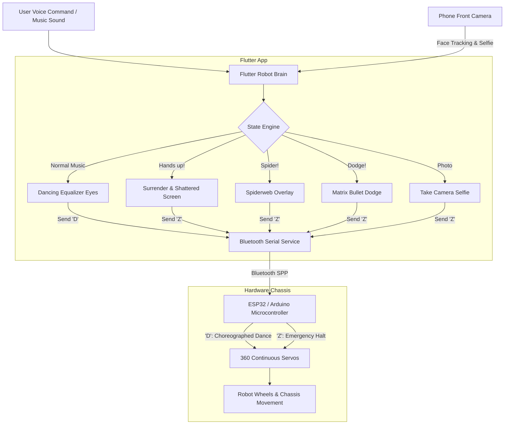

# Overdramatic Companion Robot 🎯🤖💥

## Basic Details
### Team Name: Mashkoor asim k

### Team Members
- Team Lead: Mashkoor asim k-Cochin University College of Engineering Kuttanad

Project Description

Overdramatic Companion Robot is an unnecessarily dramatic robotic companion that has absolutely no useful purpose — and that's exactly the point.

The robot has a custom self-designed and 3D-printed body, an Android smartphone acting as its animated face and brain, and an ESP32 controlling its physical movement.

Normally, it dances uncontrollably to music using two continuous 360° servos.

But the moment someone says "Hands up!", the robot instantly freezes, raises its hands, trembles in fear, begs for mercy in Malayalam, and dramatically surrenders.

It can also dodge imaginary bullets, panic at spiders, track faces, take voice-controlled selfies, and perform completely unnecessary dramatic reactions.

### The Problem (that doesn't exist)
Sci-fi movies have convinced everyone that artificial intelligence will inevitably become a ruthless, invincible killing machine that overthrows humanity. What society is truly missing is a robot that is an absolute coward—one that possesses zero combat capability, prioritizes its own hilarious self-preservation, and surrenders unconditionally the second anyone raises their voice.

### The Solution (that nobody asked for)
A Flutter-powered animated robot face running on an Android smartphone, paired via Bluetooth Serial to an ESP32 / Arduino chassis with continuous 360° servos. Under normal conditions, it grooves and dances to the beat with animated equalizer eyes while driving choreographed wheel steps (`'D'`). The moment a user says *"Hands up!"*, it freezes the motors (`'Z'`), throws its hands up in terror, begs for mercy in Malayalam (*"അയ്യോ എന്നെ കൊല്ലല്ലേ! കൈ പൊക്കി!"*), fakes a shattered screen, enters a comedic rage mode, and then peacefully resumes grooving.

---

## Technical Details
### Technologies/Components Used
For Software:
- **Languages**: Dart, C++ (Arduino / ESP32)
- **Frameworks**: Flutter (Android SDK)
- **Libraries**:
  - `speech_to_text`: Real-time voice command recognition
  - `flutter_tts`: Malayalam voice speech synthesis
  - `camera`: Front camera vision & face gaze tracking
  - `flutter_bluetooth_serial`: Classic Bluetooth SPP communication
  - `audioplayers`: Gunshot, glass shattering, and grooving sound FX
  - `ESP32Servo`: 50Hz precision PWM servo control for continuous rotation wheels
- **Tools**: VS Code, Android Studio, ADB, Arduino IDE

For Hardware:
- **Main Components**:
  - ESP32 Dev Module (with built-in Bluetooth SPP) 
  - 2x Continuous Rotation 360° Servos (Left: GPIO 18, Right: GPIO 19)
  - 2-Wheel Differential Robot Chassis with Front Caster Ball(3d printed)
  - Android Smartphone (used as the Robot Face display, vision system, and voice brain)
  - Common Ground jumper connection
- **Specifications**:
  - Microcontroller: ESP32 dual-core 240MHz with built-in 2.4GHz Bluetooth RFCOMM
  - Wheel Actuation: 360 continuous differential PWM drive (stop neutral: 90°)
  - Baud Rate: 115,200 bps
- **Tools Required**:
  - Soldering Iron / Jumper Wires
  - Screwdriver & Chassis Hardware
  - USB Type-C Cable for flashing ESP32

---

### Implementation
For Software:

# Installation
```bash
# Clone the repository
git clone https://github.com/tinkerhub/useless_project_temp.git
cd useless_project_temp

# Fetch Flutter dependencies
flutter pub get
```

# Run
```bash
# 1. Flash the ESP32 Firmware
# Open arduino/esp32_robot_wheels.ino in Arduino IDE
# Install the "ESP32Servo" library via Tools -> Manage Libraries
# Select your ESP32 board and COM port, then click Upload

# 2. Run the Flutter Robot Face on your connected Android phone
flutter run --release
```

---

### Project Documentation
For Software:


# Diagrams

*System Architecture: Seamless integration of smartphone vision, voice processing, UI animations, and Bluetooth serial wheel coordination.*

---

For Hardware:

# Schematic & Circuit

```
+-------------------------------------------------------------+
|                     ESP32 Dev Module                        |
|                                                             |
|   GPIO 18 -----------------> [Left 360 Servo Signal (PWM)]  |
|   GPIO 19 -----------------> [Right 360 Servo Signal (PWM)] |
|   GND     ----+                                             |
+---------------|---------------------------------------------+
                |
                +------------+ (Common Ground)
                             |
+----------------------------v--------------------------------+
|             External Battery Pack (5V - 6V)                 |
|                                                             |
|   Positive (+) ------------> [Servos VCC (Red wires)]       |
|   Negative (-) ------------> [Servos GND (Brown/Black)]     |
+-------------------------------------------------------------+
```
*Wiring Connection: High-current servos powered by an isolated battery pack sharing a common ground with the ESP32.*

# Build Photos
https://photos.app.goo.gl/xSrT8q8iCoFxZq5q8

---

### Project Demo
# Video
https://photos.app.goo.gl/cDLLWeKgBWpF8Yst8
https://photos.app.goo.gl/xSrT8q8iCoFxZq5q8
obot grooving to music, spinning its wheels on beat, abruptly halting and begging for mercy when "Hands up" is shouted, dodging bullets, and taking selfies.*

# Additional Demos
- ESP32 Built-in Bluetooth Sketch: [`arduino/esp32_robot_wheels.ino`](arduino/esp32_robot_wheels.ino)


---
Made with ❤️ at TinkerHub Useless Projects 


